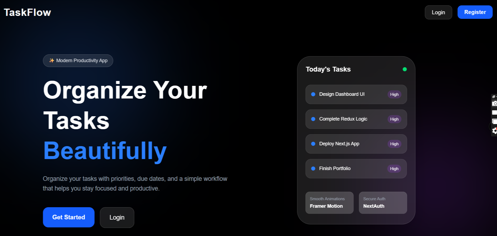
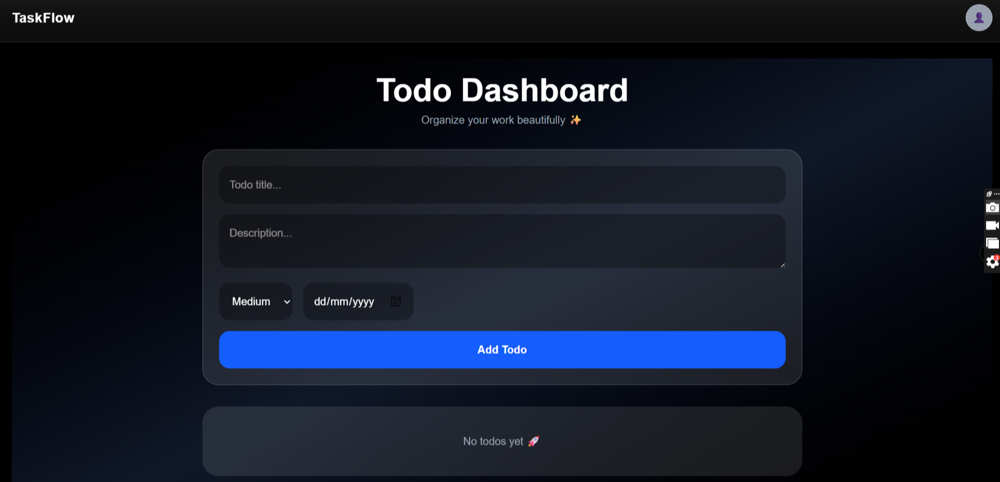
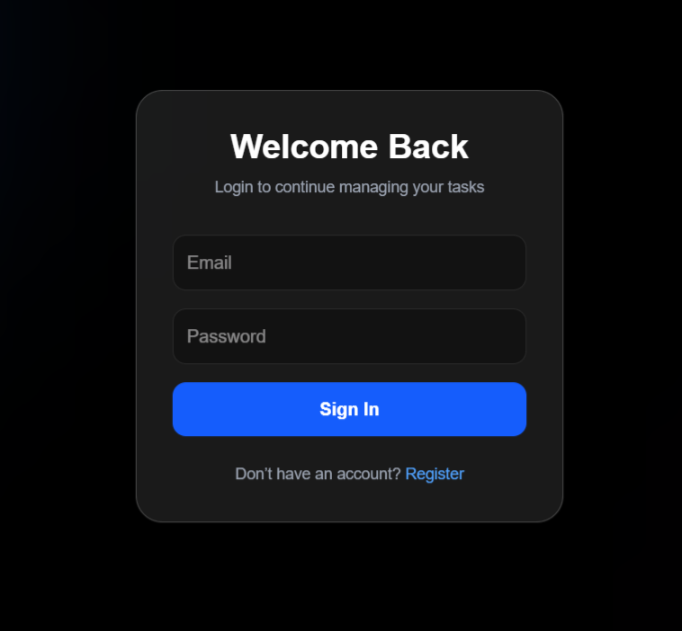
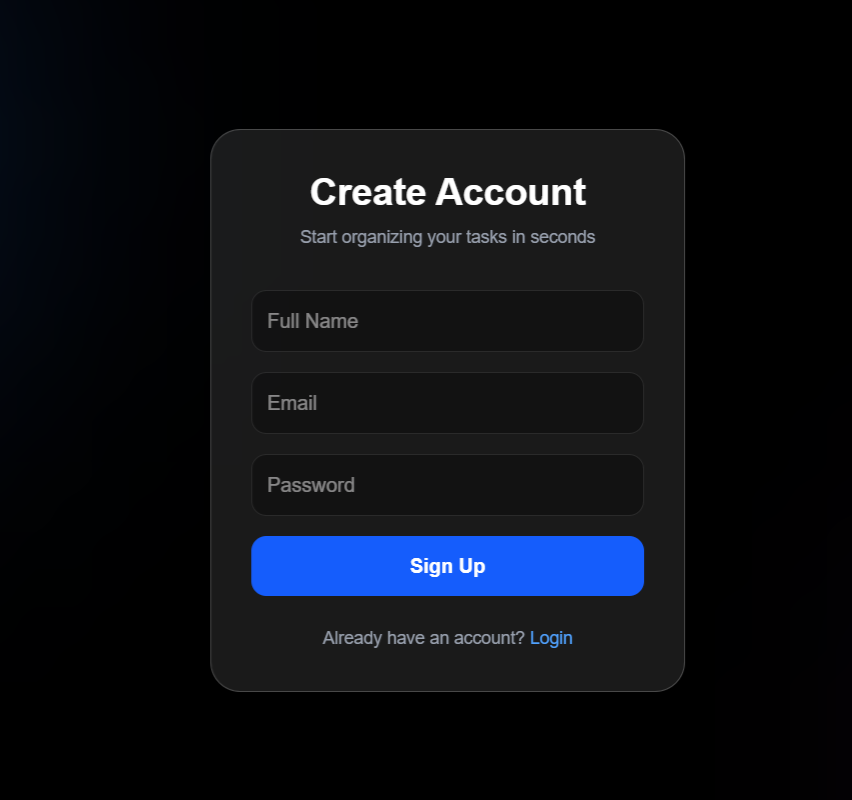
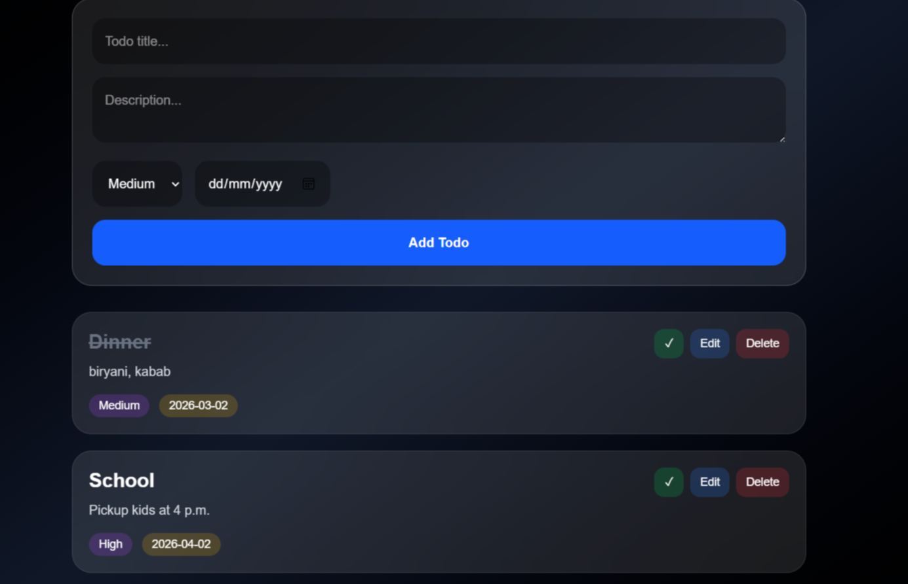

<h1 align="center">Full Stack Todo App</h1>

<p align="center">
  A modern full-stack Todo application built with Next.js, TypeScript, MongoDB, Redux Toolkit, Tailwind CSS, and NextAuth.
</p>

---

## 🚀 Live Demo

🔗 https://todoapp-nextjs-alpha.vercel.app/

---

## 📸 Project Preview

### Home Page


### Dashboard


### Login Page


### Register Page


### Todo Page


---

## ✨ Features

- 🔐 Authentication using NextAuth
- 📝 Create Todo
- ✏️ Update Todo
- ❌ Delete Todo
- ✅ Mark Todo as Completed
- ⚡ Redux Toolkit State Management
- 🎨 Responsive UI with Tailwind CSS
- 🔒 Protected Routes
- 📦 MongoDB Database Integration
- 🔔 Toast Notifications

---

## 🛠️ Tech Stack

### Frontend
- Next.js
- TypeScript
- Tailwind CSS
- Redux Toolkit

### Backend
- Next.js API Routes
- MongoDB
- Mongoose

### Authentication
- NextAuth.js

---

## 📂 Folder Structure

```bash
src/
 ├── app/
 ├── components/
 ├── redux/
 ├── models/
 ├── lib/
 ├── api/
```

---

## ⚙️ Installation & Setup

Clone the repository

```bash
git clone https://github.com/sayeeda-heena/todoapp-nextjs.git
```

Go to project folder

```bash
cd todoapp-nextjs
```

Install dependencies

```bash
npm install
```

Create `.env.local`

```env
MONGODB_URI=your_mongodb_uri
NEXTAUTH_SECRET=your_secret_key
NEXTAUTH_URL=http://localhost:3000
```

Run the development server

```bash
npm run dev
```

Open in browser

```bash
http://localhost:3000
```

---


## 👩‍💻 Author

### Sayeeda Heena

- GitHub: https://github.com/sayeeda-heena

---

## ⭐ Support

If you like this project, give it a ⭐ on GitHub.
